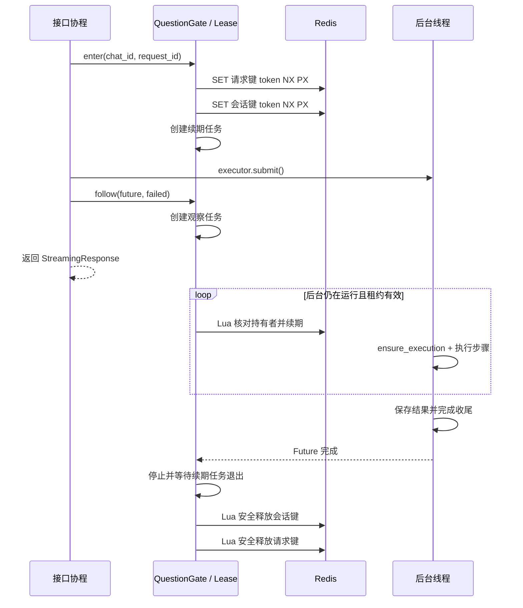
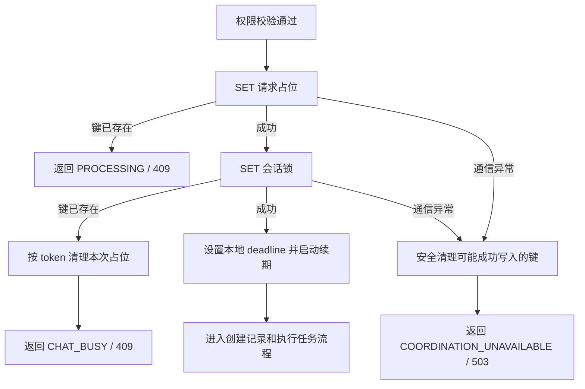

# 问数双锁源码详解与调用链

2026-09-14 的两阶段获取锁、终态回放及遗留 PROCESSING 处理，见[回放实现与联调](D:/SQLBot-main/项目学习文档/问数结果回放实现与联调.md)。下文保留第一阶段说明。

关于方案如何形成、个人决策与面试表达，参见[设计决策复盘（面试版）](D:/SQLBot-main/项目学习文档/问数幂等与回放设计决策复盘_面试版.md)。

本文对应 2026-09-13 的第一阶段源码，配合[实现与验证说明](D:/SQLBot-main/项目学习文档/问数双锁第一阶段实现与验证.md)阅读。这里解释已经写出的代码，不把未来的回放、持久化状态机或数据库写入保护当作现成功能。

## 1. 先明确三个生命周期

一次问数同时涉及三个生命周期：

| 生命周期 | 什么时候结束 | 是否可以据此释放锁 |
| --- | --- | --- |
| 接口函数 | 返回 `StreamingResponse` 或 JSON 响应 | 流式响应返回时后台可能还在运行，不能直接释放 |
| 浏览器接收响应 | 收完流、关闭页面、点击停止或断网 | 不能证明后台线程停止 |
| 后台执行任务 | 线程池 Future 完成，包括生成器执行和收尾 | 正常情况下由它触发最终释放 |

这就是代码要使用独立观察任务的原因：**锁跟随实际执行任务，而不是跟随浏览器连接。**

代码主要分布在：

| 文件 | 作用 |
| --- | --- |
| [config.py](D:/SQLBot-main/backend/common/core/config.py) | 读取连接地址、键前缀、租约、续期间隔、任务推进时限 |
| [idempotency_redis.py](D:/SQLBot-main/backend/common/core/idempotency_redis.py) | Redis 客户端生命周期、键名生成、创建 `QuestionGate` |
| [question_gate.py](D:/SQLBot-main/backend/common/core/question_gate.py) | 获取、续期、释放、任务观察与门禁状态 |
| [main.py](D:/SQLBot-main/backend/main.py) | 将上述资源接入 FastAPI 启动和关闭 |
| [chat.py](D:/SQLBot-main/backend/apps/chat/api/chat.py) | 权限检查、问数入口、门禁错误响应、提交执行任务 |
| [llm.py](D:/SQLBot-main/backend/apps/chat/task/llm.py) | 捕获本轮租约、实际执行、失锁检查、移交锁清理责任 |
| [mcp.py](D:/SQLBot-main/backend/apps/mcp/mcp.py) | MCP 问数入口接入同一套门禁 |

## 2. 应用启动：先准备共享资源

调用链：

```text
FastAPI lifespan(app)
└─ idempotency_redis_lifespan(app, url, prefix, ttl, interval, max_runtime)
   ├─ IdempotencyKeys(prefix)
   ├─ QuestionGate(None, keys, ...)
   ├─ Redis.from_url(...)
   ├─ await client.ping()
   ├─ app.state.idempotency_redis = client
   ├─ app.state.question_gate.redis = client
   └─ yield：进入原有初始化与应用运行阶段
```

`app.state` 保存当前应用实例的资源。每个 worker 有自己的 Redis 客户端、门禁对象和本地任务集合；多个 worker 通过同一个 Redis 实例中的键协调。

配置对应关系：

| 配置 | 默认值 | 实际用途 |
| --- | --- | --- |
| `IDEMPOTENCY_REDIS_URL` | `None` | 专用 Redis 连接；本机 `.env` 指向 `redis://127.0.0.1:6379/1` |
| `IDEMPOTENCY_REDIS_KEY_PREFIX` | `sqlbot:local` | 区分环境和键用途 |
| `IDEMPOTENCY_LOCK_TTL_SECONDS` | 60 | 转换成毫秒传给 Redis 的 PX/PEXPIRE |
| `IDEMPOTENCY_RENEW_INTERVAL_SECONDS` | 20 | 续期协程的检查间隔 |
| `IDEMPOTENCY_TASK_MAX_SECONDS` | 600 | 从创建本轮租约开始计算的推进时限，包含准备及排队 |

客户端连接和单次 Redis 命令的超时均配置为 3 秒。这与“锁活多久”“任务允许运行多久”是三个不同概念。

未配置连接时，应用可启动，但受门禁保护的操作返回 503；配置了连接却 PING 失败时，启动会报错。关闭阶段先调用 `QuestionGate.shutdown()`，再关闭客户端，避免先关闭 Redis 后仍让续期任务继续使用它。

## 3. 两个类：管理器与本轮租约

### 3.1 QuestionGate：应用级管理器

`QuestionGate` 保存：

| 字段 | 含义 |
| --- | --- |
| `redis`、`keys` | Redis 客户端和键名生成器 |
| `ttl`、`renew_interval`、`max_runtime` | 时间参数 |
| `tasks` | 观察任务、清理任务的强引用集合；任务结束后移除 |
| `leases` | 本进程持有的活跃租约对象 |
| `closing` | 应用关闭时停止接收新任务 |

主要方法：`acquire()` 获取锁，`enter()` 包装入口生命周期，`track()` 管理异步任务引用，`shutdown()` 关闭时撤销执行资格并停止续期。

### 3.2 QuestionLease：一次执行的锁管理对象

`QuestionLease` 不是数据库记录，也不是 Redis 中的一个 JSON 对象。它是当前 Python 进程中的对象。

| 字段 | 含义 |
| --- | --- |
| `keys` | 本轮要操作的键列表：普通问数为请求键、会话键；旧分析/预测入口只有会话键 |
| `token` | `uuid4().hex` 生成的持有者标识 |
| `state` | 本地执行状态 |
| `started` | 本轮开始时的单调时钟读数 |
| `deadline` | 本地认为租约仍有效的截止时间 |
| `renewal` | 后台续期协程任务 |
| `observer` | 等待线程池 Future 的观察任务；也是责任是否已移交的判断依据 |
| `closed` | 避免重复进入正常清理流程的本地标记 |

`request_id` 与 `token` 的区别：同一操作网络重试要保留 request_id，但每次进入抢锁流程都会创建新 token。因此，重复请求不会拿着原任务的持有者标识去释放原任务的锁。

Redis 当前只保存：

```text
key = sqlbot:local:request:processing:1:r1
value = 本次执行的随机 token

key = sqlbot:local:chat:lock:1
value = 同一个 token
```

`SUCCESS`、答案、SQL、图表都没有写入这些键。

## 4. 普通提问的完整函数调用链

```text
前端 index.vue：sendMessage()
  └─ 创建 ChatRecord 和新的 request_id
     └─ ChartAnswer.vue：sendMessage()
        └─ ensureRequestId(currentRecord)：同一对象重发时保留 ID
           └─ questionApi.add() → POST /chat/question

后端参数模型 ChatQuestionBase：校验 request_id
  └─ question_answer()：权限装饰器 + 构建 ChatQuestion
     └─ guarded_question(app.state.question_gate, ...)
        ├─ 检查会话存在及工作空间访问资格
        └─ async with gate.enter(chat_id, request_id)
           ├─ acquire()：获取请求占位、会话锁，启动续期
           ├─ active_question_lease.set(lease)
           └─ question_answer_inner()
              ├─ parse_quick_command()：区分普通提问与命令
              └─ stream_sql()
                 ├─ await LLMService.create(...)
                 │  └─ __init__() 捕获 active_question_lease
                 ├─ init_record() → 保存本轮问答记录
                 └─ run_task_async()
                    ├─ executor.submit(run_task_cache, ...)
                    └─ lease.follow(future, lambda: self.execution_failed)
                       └─ 创建 _observe()：接管最终清理责任

接口响应支路：
  ├─ 流式：StreamingResponse(llm_service.await_result())
  └─ 非流式：await asyncio.to_thread(collect_result, llm_service)

后台线程支路：
  run_task_cache()
    └─ cache_execution(run_task(...))
       └─ run_task()：检索、生成 SQL、执行 SQL、生成图表、保存结果
          └─ finally：finish()，再确保 session_maker.remove()

Future 完成：
  _observe() 更新本地状态
    └─ finally → close() → stop_renewal() → 安全释放两个锁
```

这里 `run_task_cache` 中的“cache”指执行流片段暂存在 `self.chunk_list` 中，供 `await_result()` 消费，**不是 Redis 成功回放缓存**。

### 正常请求时序图



## 5. acquire()：两次获取及失败清理

核心代码是：

```python
acquired = await self.redis.set(
    key, lease.token, nx=True, px=int(self.ttl * 1000)
)
```

NX 表示只在键不存在时写入，PX 同时设置毫秒过期时间。普通请求按 `keys` 的顺序先请求占位、后会话锁；这两次 SET 不是一个跨键事务，中间失败由补偿清理处理。



三个具体例子：

| 已运行任务 | 新到请求 | 结果 |
| --- | --- | --- |
| chat=1，request=r1 | chat=1，request=r1 | 请求占位失败，PROCESSING |
| chat=1，request=r1 | chat=1，request=r2 | 请求占位成功，会话锁失败，清理 r2 后返回 CHAT_BUSY |
| chat=1，request=r1 | chat=2，request=r1 | 两组键不同，可分别执行 |

为什么 Redis 报错时也清理？因为命令可能已经执行成功，只是回复丢失了。`acquire()` 对所有本轮目标键尝试按 token 清理，而不是只清理“客户端明确收到成功”的键。没有取得的键或别人持有的键不会被删除。

`acquire()` 捕获异常后创建独立清理任务，通过 `track()` 保留引用，再 `await asyncio.shield(cleanup)`。这减少了接口取消导致清理协程一起被取消的风险。它不是进程崩溃后的保障；进程消失仍依赖 TTL。

## 6. ContextVar：如何把租约传到 LLMService

`QuestionGate.enter()` 获取锁后执行：

```python
context_token = active_question_lease.set(lease)
try:
    yield lease
finally:
    active_question_lease.reset(context_token)
    # 尚未交给后台任务时，由入口负责清理。
    if lease.observer is None:
        ...
```

`ContextVar` 保存的是当前异步执行上下文中的值，避免不同请求用一个普通全局变量而相互覆盖。`reset()` 恢复进入上下文前的值，防止后续处理误用本轮租约。

`LLMService.__init__()` 在接口协程中执行：

```python
self.execution_lease = active_question_lease.get()
self.execution_failed = False
self.ensure_execution()
```

随后后台线程使用已保存的 `self.execution_lease`。代码没有依赖 `executor.submit()` 自动传播 ContextVar，也没有在线程中直接访问异步 Redis 客户端。

对于没有经过门禁的辅助链路，捕获到的值为 `None`，`ensure_execution()` 不做租约检查。所以“类里有检查方法”不等于所有使用这个类的入口都已获得锁。

## 7. follow() 与 _observe()：何时移交清理责任

`LLMService.run_task_async()` 先检查执行资格，再提交线程池：

```python
self.future = executor.submit(self.run_task_cache, ...)
if self.execution_lease is not None:
    self.execution_lease.follow(self.future, lambda: self.execution_failed)
```

上面的省略号表示调用参数，代码顺序与源码一致。提交成功后紧接着 `follow()`，其中没有一次主动 `await`。

`follow()` 将非 LOST 状态改为 RUNNING，并创建 `_observe()`。当 `gate.enter()` 退出时：

- `observer is None`：尚未交接，例如服务初始化或提交任务失败，入口清理。
- `observer` 已存在：已经交接，入口只恢复上下文，不释放后台仍需要的锁。

观察任务的关键等待是：

```python
await asyncio.shield(asyncio.wrap_future(future))
```

`executor.submit()` 返回线程池的 `concurrent.futures.Future`。`wrap_future()` 让异步协程可以等待它，`shield()` 避免观察协程取消时连带把包装后的 Future 取消。它不能让 Python 线程获得强制取消能力。

正常返回时还要调用 `failed()`，也就是读取 `self.execution_failed`。原因是业务生成器会捕获一些模型/SQL 异常并输出错误消息，此时线程函数可能正常返回，单看 Future 有没有异常无法判定业务成功。

| 观察结果 | 状态与清理 |
| --- | --- |
| Future 正常结束，failed 为 False | SUCCESS，最终清理 |
| Future 正常结束，failed 为 True | FAILED，最终清理 |
| Future 抛出普通异常 | FAILED，记录异常并最终清理 |
| 状态已经 LOST | 不再覆盖成 SUCCESS/FAILED；线程真正结束后可以清理 |
| 观察任务被取消，Future 已结束或排队任务已取消 | 可以清理 |
| 观察任务被取消，Future 仍未结束 | 标记 LOST、停止续期，不主动删除锁，等待 TTL |

## 8. 续期与失锁检查

### 8.1 _renew() 每 20 秒做什么

```text
asyncio.sleep(renew_interval)
  → renew_once()
     → ensure_active() 检查本地资格
     → 执行 RENEW Lua
     → 再次 ensure_active()
     → 确认 Lua 返回成功
     → deadline = 发出本次续期前的单调时钟时间 + ttl
```

使用命令发出前的时间计算 deadline，而不是收到回复时再加 60 秒，是为了避免网络等待被误算为额外租约。

第二次本地检查防止“回复很晚到达，但本地租约已经过期”时重新认为自己恢复了执行资格。

实际续期脚本：

```lua
for i, key in ipairs(KEYS) do
    if redis.call('get', key) ~= ARGV[1] then return 0 end
end
for i, key in ipairs(KEYS) do redis.call('pexpire', key, ARGV[2]) end
return 1
```

`KEYS` 是本轮一个或两个键，`ARGV[1]` 是 token，`ARGV[2]` 是 TTL 毫秒数。先全部检查，再全部续期；键过期后 GET 返回空，不会重新创建它。

当前 `_renew()` 遇到续期异常直接标记 LOST 并结束，没有另外编写“剩余租约内多次重试”的业务循环。这是当前实现与早期讨论中的可选重试方案的区别。

### 8.2 ensure_active() 检查什么

满足任意一个条件就设置 LOST 并抛出 `LeaseLostError`：

1. `closed` 已经为 True。
2. 状态已经是 LOST。
3. 当前 `time.monotonic()` 达到 `deadline`。
4. 当前时间减 `started` 达到 `max_runtime`。

单调时钟用于计算时长，不依赖系统日期的前后调整。每个检查点只检查本地状态和时间，不额外执行一次 Redis GET。Redis 中的所有权变化通常由续期发现，因此这不是实时、原子的跨数据库写入校验。

### 8.3 cache_execution() 如何阻止继续推进

它手动驱动业务生成器：

```text
ensure_execution()
  → next(generator)
  → ensure_execution()
  → chunk_list.append(chunk)
  → 下一轮
```

前后都检查：防止已经失锁还进入下一步，也防止等待模型片段期间失锁后继续发布片段。关键模型调用和保存方法附近也加入检查，例如 `generate_sql()`、`check_save_sql()`、`save_sql_data()`、`check_save_chart()`。

捕获 `LeaseLostError` 后设置 `execution_failed=True`，向流式或非流式结果写入 LEASE_LOST 错误，并在 finally 中关闭生成器。`finish()` 发现失锁时跳过完成状态写入，防止旧任务在失锁后标记完成。

这些检查不能撤销已经发出的网络调用，也不能保证“检查后、数据库提交前”不会失锁。它们实现的是协作式停止后续推进，数据库侧执行版本校验仍是后续工作。

## 9. close()：为什么先停续期，再释放两个锁

调用顺序：

```text
close()
├─ closed 已为 True：返回
├─ closed = True
├─ await stop_renewal()
│  ├─ renewal.cancel()
│  ├─ await gather(renewal, return_exceptions=True)
│  └─ renewal = None
├─ 反向遍历 keys：先会话键、后请求键
│  └─ 分别执行 RELEASE Lua
└─ 从 gate.leases 移除本轮租约
```

实际释放脚本：

```lua
if redis.call('get', KEYS[1]) == ARGV[1] then
    return redis.call('del', KEYS[1])
end
return 0
```

不能把它拆成 Python 中先 GET 再 DEL：两次命令之间旧锁可能已经过期并被别人取得。Lua 将比较和删除作为一次原子操作执行。

不能直接 DEL：例如 A 的锁过期，B 已经获得同名锁，A 迟到的清理只能发现 token 不同并返回 0，不能删除 B 的锁。

每把锁的释放有独立 try/except。会话锁释放出错，仍继续尝试请求键。`closed=True` 只代表本地进入过清理流程，不证明 Redis 的键一定删除成功；释放失败会记录日志并依靠 TTL，而不会持续重试到成功。

## 10. 三层 finally 的职责

| 位置 | 负责的资源 |
| --- | --- |
| `QuestionGate.enter()` 的 finally | 恢复 ContextVar；尚未移交时清理锁 |
| `run_task()` 的 finally | 调用 `finish()`，并在内层 finally 确保 `session_maker.remove()` |
| `QuestionLease._observe()` 的 finally | 根据真实 Future 是否结束，选择释放锁或仅停止续期 |

上表中的职责列是三层清理的核心。业务生成器的 finally 不直接调用异步 Redis；Redis 清理由事件循环里的观察任务执行。

分析/预测任务的收尾布局与普通 `run_task()` 不完全相同：它在成功路径调用 `finish()`，finally 主要清理数据库 Session，但同样由观察任务负责锁释放。不要把普通问数的每个收尾位置机械套用到所有方法。

进程被强制终止、机器断电时，finally 未必执行。应用主动 shutdown 时也不能假定线程已停止：`shutdown()` 设置 closing，标记活跃租约 LOST，停止续期并取消观察任务；仍在运行的线程保留键等待过期。

## 11. 其他入口与前端反馈

### 重新生成

```text
新 request_id + /regenerate 命令
  → question_answer()
  → guarded_question() 取得同一 chat_id 的会话锁
  → question_answer_inner() 解析目标 record_id、校验归属、查找原问题
  → 修改 question 和 regenerate_record_id
  → stream_sql()
```

修改问题文本和目标记录引用不会重新生成 request_id。目标记录查找发生在锁内，避免绕过门禁后再竞争。

### MCP 问数

```text
mcp_question() → get_user() → ChatMcp
  → guarded_question() → question_answer_inner()
  → stream_sql() 或 analysis_or_predict()
```

非流式模式使用 `asyncio.to_thread(collect_result, llm_service)` 等待结果，避免原来的同步收集循环阻塞主事件循环，影响续期。

### 独立分析/预测接口

```text
analysis_or_predict_question()
  → 校验 record 和 chat 的用户、工作空间归属
  → gate.enter(record.chat_id, None)
  → analysis_or_predict()
  → run_analysis_or_predict_task_async()
  → lease.follow(future, failed)
```

`request_id=None` 是旧接口的显式兼容路径，只有会话锁。普通问数的请求模型仍要求非空 request_id，不能借此理解成普通问数允许缺失 ID。

### 前端反馈

`gate_error_response()` 返回非流式 JSON，例如：

```json
{
  "code": "CHAT_BUSY",
  "message": "Another request is running in this chat; please try again when it finishes",
  "request_id": "r2"
}
```

`ChartAnswer.vue` 先检查 `response.ok`。遇到 CHAT_BUSY/PROCESSING，发出 `request-rejected` 事件并进入错误展示。父组件 `onQuestionRejected()` 只在 CHAT_BUSY 且输入框为空时恢复本次问题；不覆盖用户已经输入的新文本。

当前保留错误记录占位，不自动重试、不排队。分析和预测组件也会检查非 2xx 响应并展示错误。

## 12. 状态的准确含义与阅读顺序

NEW 在 `QuestionLease.__init__()` 中就被赋值，所以内部创建了 NEW 对象不代表获取锁成功。外部只有 `acquire()` 成功返回之后才能继续推进。PROCESSING/CHAT_BUSY 通过 `GateRejected` 返回，是竞争结果，不能理解为这两个状态都曾写到原任务的 state 字段。

SUCCESS/FAILED/LOST 是本地状态，没有落到 Redis 回放记录或 PostgreSQL 状态表。PROCESSING 严格表示“占位键存在”，遇到进程失联时可能是尚未过期的占位，并不能证明原线程此刻仍然存活。

建议按以下顺序阅读代码：

1. `IdempotencyKeys`：先弄清键和值。
2. `QuestionGate.acquire()`：理解谁能进入。
3. `QuestionGate.enter()`：理解上下文和入口清理。
4. `guarded_question()` → `stream_sql()`：定位门禁在业务中的位置。
5. `LLMService.__init__()` → `run_task_async()` → `follow()`：理解责任交接。
6. `_renew()` → `renew_once()` → `ensure_active()`：理解时间与所有权。
7. `cache_execution()` → `run_task()`：理解后台如何响应失锁。
8. `_observe()` → `close()` → `shutdown()`：理解正常、异常和关闭时的释放。

## 13. 测试覆盖与剩余工作

| 测试文件 | 验证内容 |
| --- | --- |
| [test_question_gate.py](D:/SQLBot-main/tests/test_question_gate.py) | 15 项：竞争、不同会话并行、旧接口会话锁、续期与所有权、取消、提交失败、观察任务清理、失锁、超时与 Redis 不可用 |
| [test_question_gate_routes.py](D:/SQLBot-main/tests/test_question_gate_routes.py) | 4 项：执行实际 API 函数体并隔离模型/数据库，验证先授权、先门禁再创建服务、响应返回后持锁、提交失败释放 |
| [test_question_request.py](D:/SQLBot-main/tests/test_question_request.py) | 6 项：request_id 校验、传递及执行层响应字段 |
| [test_idempotency_redis.py](D:/SQLBot-main/tests/test_idempotency_redis.py) | 4 项：键名、连接初始化、异常关闭与未配置行为 |
| [check_question_gate_redis.py](D:/SQLBot-main/tests/check_question_gate_redis.py) | 独立随机前缀下执行真实 Redis 竞争、续期、所有权和结束释放检查 |

这些结果不能替代全部浏览器/模型联调，也没有验证 Redis 故障切换下的严格单次执行。下一阶段需要接成功结果记录与回放；更强的失锁后数据库写入保护、异常记录恢复仍需独立设计。
